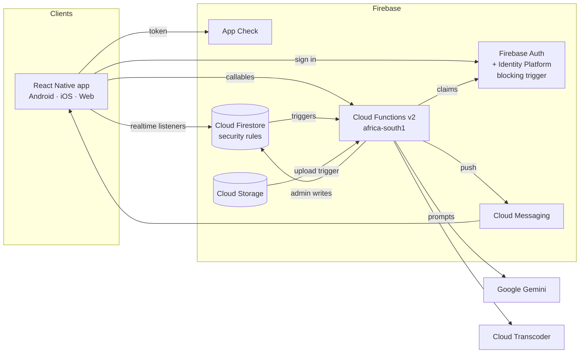

# Richfield Connect — Presentation & Demo Script

Campus Round, 15 September 2026, 09:30. Slot: 30–45 minutes including the live demo.

Every slide below maps to a rubric line. Items marked **⚠️ TONIGHT** depend on work
being finished in tonight's sprint — confirm with Dali before presenting them, and
move them to the roadmap slide if they did not land.

Suggested presenters follow the README ownership so each member speaks to what they
built (rubric 13: *"All team members present a portion"*).

| Presenter | Slides | Demo segment |
|---|---|---|
| Mosa | 1–4 (problem, roles, auth) | — |
| Lindelani | 5–6, 15 (profiles, POPIA) | Student profile & privacy |
| Evan | 7–8 (social, real-time) | Connections & messaging |
| Ina | 9–10 (AI assistant, careers) | Onboarding & assistant |
| Dali | 11–14, 16–18 (architecture, stack, dashboards, admin) | Business & admin, demo lead |

---

## Slide 1 — Title
**Richfield Connect** — a trusted professional network for the Richfield / AAA community.
Team names and roles. One line: *"From enrolment to employment, in one verified network."*

## Slide 2 — Problem statement & scenario response *(rubric 12)*
- Graduates compete on visible portfolios and networks, not only qualifications.
- Employers struggle to find verified Richfield talent; students struggle to be seen before graduating.
- Alumni lose their institutional email, so they fall out of the network exactly when they could help most.
- **Our response:** a mobile network where every account is verified, every profile is a portfolio,
  and every opportunity is matched to the students it fits.

## Slide 3 — Four user types and access levels *(rubric 1, 12)*
| Role | How they get in | What they can do | What they cannot do |
|---|---|---|---|
| Student | Institutional email only (`@my.richfield.ac.za`, `@richfield.ac.za`, `@my.aaa.ac.za`, `@aaa.ac.za`) | Portfolio, connect, apply, get matched | See private fields others haven't shared |
| Alumni | Registry-verified identity + email link | Mentor, recommend, post career stories | Access registry data |
| Business | Registration + **admin approval gate** | Post opportunities, discover talent | Access the app before approval; see unshared student data |
| Administrator | **Provisioned out-of-band**, never self-registered | Approve, moderate, broadcast, analytics | Suspend another administrator |

Key point to say aloud: **roles live in server-issued Firebase custom claims and are enforced in
Firestore security rules and every Cloud Function** — hiding a screen is never the security boundary.

## Slide 4 — Authentication design *(rubric 1, 12)*
- **Students:** a Firebase **blocking function** (`beforeUserCreated`) rejects any non-institutional
  email *before the account exists*. The client check is only a convenience.
- **Alumni (our researched solution):** alumni no longer have student email, so we verify identity
  against a private registry:
  1. Student number + personal email + national ID *or* birthdate.
  2. Matched server-side; the registry is never readable by any client.
  3. The response is **identical whether or not a record matched** — no account enumeration.
  4. Rate-limited per identity, per email and per IP.
  5. A one-time, 15-minute session, then a Firebase **email link** proves they control that inbox.
- **Business:** a short-lived server-issued registration intent, then `isApproved: false` until an
  administrator approves — enforced by rules, claims and every callable.
- **Administrators:** created only by a CLI script with service-account credentials
  (`admin/provision-admin.mjs`). There is no admin sign-up path in the app.
- **App Check** on every callable in production blocks scripted abuse.

## Slide 5 — User profiles as digital portfolios *(rubric 3)*
Full §2.3 schema: headline, summary, programme, campus, enrolment/graduation year, skills,
qualifications, **certifications**, work experience, **entrepreneurial ventures**, **GitHub projects**,
**deployed apps**, **digital badges + Credly**, achievements & awards, **leadership roles**,
clubs/hackathons/volunteering, career interests, LinkedIn. Business company profile including the
talent they are seeking.
**Visual:** screenshot of Thabo's profile view with every section populated.

## Slide 6 — Endorsements, recommendations, CV assistant *(rubric 3, 8)*
- Skill endorsements, one per endorser per skill, validated server-side.
- Written recommendations from connections, alumni, employers or staff — author identity taken from
  the server, never the request; reportable and moderatable.
- **NLP-assisted profile building:** paste a CV → the AI extracts headline, summary, skills,
  qualifications and experience as strict JSON, validated and length-capped server-side. It is
  instructed never to invent facts, and nothing saves until the student confirms.

## Slide 7 — Connections & personalised feed *(rubric 4)*
- Find people by name, skill, campus or role; send, accept or decline requests.
- Direct messaging between connected users only (enforced server-side).
- Posts, reactions and comments.
- **Role-differentiated feed:** every post is scored per viewer:
  `role affinity × 100 + freshness decay + reactions × 2 + comments × 3`.
  A student sees employers and alumni ranked higher; an employer sees students and alumni.

## Slide 8 — Real-time architecture *(rubric 8)*
- Firestore `onSnapshot` listeners for feed, messages, connections and approvals — **no polling**.
- Firestore-triggered Cloud Functions send **FCM push notifications** for connection requests,
  acceptances, messages, opportunity matches and announcements.
- ⚠️ TONIGHT: in-app notification inbox so alerts are visible on every platform.

## Slide 9 — AI profile assistant & onboarding *(rubric 6, 12)*
- Structured first-login onboarding: identity → programme & campus → skills → evidence → review.
- An **AI coach** at every step gives context-aware feedback: it receives the member's live profile, so
  it can say *"no skills listed means you won't appear in employer searches"* instead of generic tips.
- An always-available assistant tab for ongoing questions.
- **Genuine AI, not a script:** ⚠️ TONIGHT Google Gemini, called only from Cloud Functions so the key
  never reaches a device; the last 12 messages provide conversation memory.

## Slide 10 — Opportunities & careers *(rubric 5)*
- Businesses post internships, learnerships, part-time and graduate roles.
- **Admin approval gate:** listings are invisible to students until published.
- **Smart matching:** on approval, every student profile is scored
  (`skill overlap × 0.85 + programme match × 0.15`); matched students get a push notification —
  targeted, not a broadcast.
- ⚠️ TONIGHT: filters, career pathway explorer by programme, institutional events.

## Slide 11 — System architecture diagram *(rubric 9, 12)*
Redraw this in the deck (draw.io / Excalidraw / PowerPoint SmartArt):

Say aloud: **clients never write privileged data.** Every mutation goes through a callable that
re-derives identity from the auth token.

## Slide 12 — Mobile framework justification *(rubric 9, 12)*
| | React Native (chosen) | Flutter | .NET MAUI |
|---|---|---|---|
| Language | TypeScript — shared with our Cloud Functions | Dart — a second language | C# |
| Firebase | Mature `@react-native-firebase` modules | Mature | Weaker |
| One codebase for mobile + web admin | Yes, via react-native-web | Partial | No |
| Team skills | JavaScript/TypeScript already known | New | New |

**Why:** one language across client and backend, first-class Firebase support, and a web build that
lets the admin panel run in a browser as the brief allows.

## Slide 13 — Database justification: SQL vs NoSQL *(rubric 9, 12)*
| Need | PostgreSQL | **Firestore (chosen)** |
|---|---|---|
| Profiles with many nested lists (projects, badges, experience) | Many join tables | One document per member |
| Real-time feed, chat, approvals | Needs a separate realtime layer | Built-in listeners |
| Per-field privacy enforced by the database | Row-level security | Security rules tied to Auth claims |
| Scale for a spiky campus audience | Provisioning | Serverless |
| Complex relational queries | **Strong** | Weaker — we denormalise feeds and bound scans |

**Trade-off we accepted:** no joins and no full-text search, handled with write-time feed fan-out
and bounded server-side scans. We considered Supabase for relational queries and chose Firestore for
realtime, rules-integrated auth and serverless scaling.

## Slides 14a–c — Analytics dashboards, one per user type *(rubric 7, 12)*
**14a Student:** profile views, connections and 30-day growth, applications, post engagement,
profile completeness vs programme peers, top opportunity matches, most in-demand skills.
**14b Business:** listings, applicants, views, conversion rate, reach, applicants by programme
and by year, candidate skill demand.
**14c Administrator:** users by role, 7- and 30-day active users, retention, registrations over
time, content volume (posts, videos, opportunities), open moderation flags, pending business approvals.
**Visual:** one screenshot per dashboard, charts visible.

## Slide 15 — POPIA & data privacy *(rubric 12)*
- **Per-audience visibility:** every profile section can be shared with everyone, connections,
  students, alumni or employers independently.
- **Server-side redaction:** other members' profiles are never readable directly; the server returns
  only what that viewer is allowed to see.
- **Data minimisation:** student numbers never leave the server; the alumni registry is never
  client-readable; raw CV text is not stored (only a hash).
- **Anti-enumeration:** alumni verification gives identical responses for match and no match.
- **Accountability:** administrator actions are written to an audit log; users can report content.
- **Honest limit:** software cannot sign off POPIA compliance by itself — that requires Richfield's
  Information Officer.

## Slide 16 — Administrator panel *(rubric 2)*
Console hub with live counts → user management (approve business, suspend, revoke) → opportunity
approvals → moderation queue (reported posts, comments, profiles, recommendations) → platform
analytics → broadcast centre. ⚠️ TONIGHT: event management.

## Slide 17 — Roadmap / what's next *(be honest — judges reward it)*
List only what did not land tonight, for example: native builds on device, short-form video
upload with transcoding, interactive screen tutorial, CV and photo file upload.

## Slide 18 — Thank you / Q&A

---

## Live demo script (~15 minutes)

Run on the **most powerful laptop**, not an 8 GB machine. Seed data first:
`npm run emulators` → `npm run seed` → `npm run web:emulators`. Password for every
account: `Richfield#2026`. Keep a second browser profile signed in as admin.

| # | Presenter | Sign in as | Show | Narration cue |
|---|---|---|---|---|
| 1 | Mosa | (signed out) | Try registering `test@gmail.com` as a student → rejected | "The server refuses non-institutional emails before the account exists." |
| 2 | Ina | `thabo@my.richfield.ac.za` | Assistant tab: ask *"What should I improve first?"* | "It reads Thabo's real profile, so the advice is specific." |
| 3 | Lindelani | `thabo@…` | Portfolio → *Who can see what* | "Every section has its own audience." |
| 4 | Evan | `thabo@…` | Connections → Find people → Aisha's skills hidden → connect | "Aisha only shares skills with connections — the server hides them." |
| 5 | Evan | `thabo@…` | Open Lerato's profile → recommendation; send a message | "Recommendations come from people who actually know you." |
| 6 | Dali | `recruiter@tech-corp.co.za` | Business dashboard → post an opportunity | "It goes nowhere until an administrator approves it." |
| 7 | Dali | `admin@richfield.ac.za` | Console → approve the listing | "Approval triggers matching against every student profile." |
| 8 | Dali | `thabo@…` | Opportunities → the new match | "Thabo was matched on skills and programme — not a broadcast." |
| 9 | Dali | `admin@…` | Moderation, analytics charts, broadcast | "Every administrator action is audited." |
| 10 | Lindelani | `lerato.alumni@gmail.com` | Alumni view, write a recommendation | "Alumni rejoin the network through registry verification." |

**If something fails live:** don't debug on stage. Say *"let me show that from the recording"* and
switch to a screen recording made in the morning run-through.
